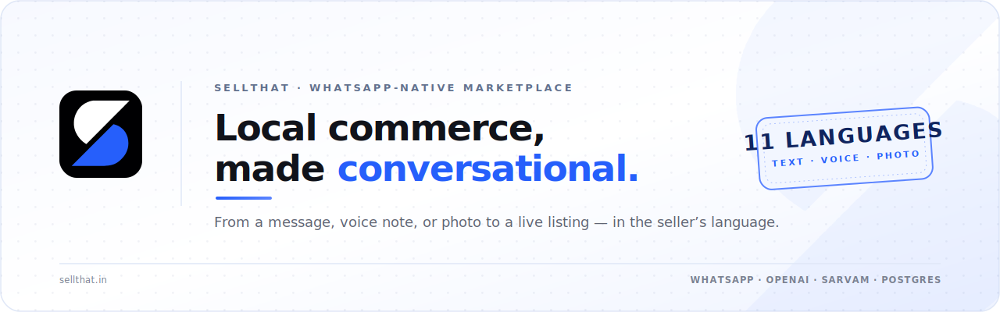

  

  <strong>List local products from WhatsApp by text, voice note, or photo — then discover them on the web.</strong>

  <a href="https://sellthat.in"><strong>Visit sellthat.in</strong></a> ·
  <a href="#quick-start">Get started</a> ·
  <a href="#public-api">Public API</a>

  WhatsApp-native marketplace · Local commerce · India · Voice AI · 11 languages

## The idea

SellThat turns the WhatsApp conversation that already happens between sellers and buyers into a simple publishing flow. A seller can describe an item in their own language, send a voice note, attach a photo, confirm the details, and receive a public marketplace link. Buyers browse the resulting listings on the web; checkout is intentionally not part of this product yet.

The experience is designed around one hard product promise: guide sellers clearly, preserve the facts they provide, and keep the response in their language.

## What is in the product

### Seller experience

- Guided WhatsApp onboarding: language, role, and verification.
- Text, voice-note, and product-photo inputs.
- English plus Hindi, Bengali, Telugu, Marathi, Tamil, Gujarati, Kannada, Malayalam, Punjabi, and Odia.
- AI-assisted extraction of title, price, quantity, category, and description.
- Deterministic safeguards: the system does not invent prices or quantities, and publishing requires an explicit confirmation.
- Voice replies generated as WhatsApp-compatible MP3 notes.
- Seller-owned listing management: update price, quantity, details, or photo; mark sold out; restock; archive; and restore.

### Marketplace

- Responsive React storefront with a newest-first product grid.
- Product detail views with image fallback, stock state, seller details, and an intentionally disabled “Buy — coming soon” button.
- WhatsApp QR and deep-link entry point for prospective sellers.
- Public, read-only API. Products are created only through the verified WhatsApp flow.

### Reliability and safety controls

- Raw-body, constant-time HMAC validation for Meta webhooks.
- Webhook acknowledgement before model, media, or database work.
- Bounded webhook and media payloads, provider timeouts, and graceful failure paths.
- Context-bound verification and publish actions: a stale or forged button cannot publish a listing.
- Per-seller message serialization to avoid local session races.
- No secrets in the browser bundle; containers bind only to localhost and are intended to sit behind host nginx.

## Architecture

~~~text
Seller on WhatsApp                          Buyer in browser
        │                                           │
        ▼                                           ▼
  Meta Cloud API                             sellthat.in
        │                                           │
        └─────────────── host nginx + TLS ──────────┘
                                  │
              ┌───────────────────┼───────────────────┐
              ▼                   ▼                   ▼
         Bun + Hono          React + nginx        PostgreSQL
       webhook / API          marketplace       sellers / sessions /
       agent / media                            products / images
              │
   ┌──────────┼──────────┐
   ▼          ▼          ▼
 Meta      OpenAI      Sarvam
WhatsApp    agent    STT / TTS / language
~~~

The backend is one Bun + Hono application. It owns the WhatsApp webhook, public read API, image delivery, conversation state, provider integrations, and database access. The frontend is a deliberately small React SPA served by nginx.

## Repository map

~~~text
.
├── assets/
│   └── sellthat-banner.svg      Self-contained README banner
├── backend/
│   ├── src/
│   │   ├── agent.ts             Seller flow, tool gates, listing management
│   │   ├── lang.ts              Sarvam STT, TTS, translate, language detection
│   │   ├── products.ts          Product, image, seller, and publishing queries
│   │   ├── session.ts           Conversation state and rolling history
│   │   └── whatsapp/            Webhook, signature, parser, media, sender
│   ├── tests/                   Focused Bun tests
│   └── .env.example             Safe configuration template
├── frontend/
│   ├── src/                     React marketplace
│   ├── public/                  SellThat logo assets
│   └── nginx.conf               SPA container configuration
├── infra/
│   ├── initdb/01-schema.sql     PostgreSQL schema and demo listing seed
│   └── nginx/sellthat.conf      Host reverse-proxy bootstrap configuration
└── docker-compose.yml           Postgres, backend, and frontend services
~~~

## Stack

| Concern | Technology |
| --- | --- |
| Backend | Bun + Hono + TypeScript |
| Database | PostgreSQL 16 with postgres.js |
| Validation | Zod |
| Conversation agent | OpenAI Chat Completions |
| Voice and language | Sarvam STT, TTS, translate, language identification |
| Seller channel | Meta WhatsApp Cloud API |
| Marketplace | React 18 + Vite + Tailwind CSS |
| Deployment | Docker Compose, host nginx, Certbot, Cloudflare-compatible TLS |

## Quick start

### Prerequisites

- Docker Engine with Docker Compose.
- Bun for backend checks and tests.
- Node.js 22+ with npm for frontend checks and builds.
- A PostgreSQL instance only when running the backend outside Compose.
- Meta WhatsApp Cloud API, OpenAI, and Sarvam credentials for the real seller flow.

### 1. Create local configuration

~~~bash
cp backend/.env.example backend/.env
chmod 600 backend/.env
~~~

Fill only the values in your local backend environment file. Never paste real tokens into source, documentation, screenshots, issue comments, or frontend variables.

The backend requires these values at boot:

| Variable | Purpose |
| --- | --- |
| WHATSAPP_TOKEN | Meta system-user token used for sends and media access |
| WHATSAPP_PHONE_NUMBER_ID | WhatsApp Cloud API sender identifier |
| WHATSAPP_APP_SECRET | Verifies the inbound webhook HMAC |
| WHATSAPP_VERIFY_TOKEN | Meta webhook challenge token |
| OPENAI_API_KEY | Conversation-agent access |
| SARVAM_API_KEY | STT, TTS, translation, and language-identification access |
| DATABASE_URL | PostgreSQL connection string |

Useful defaults are provided for the WhatsApp API version, model names, TTS speaker, TTS length, public URL, and port. Set COMMUNITY_LINK to a real community invite for the complete verification hand-off; the template default is deliberately a placeholder.

| Optional variable | Default | Purpose |
| --- | --- | --- |
| WHATSAPP_API_VERSION | v23.0 | Meta Graph API version |
| WHATSAPP_DISPLAY_NUMBER | Empty | Reserved display number configuration |
| OPENAI_MODEL | gpt-5.4-mini | Text-only conversation agent |
| SARVAM_STT_MODEL | saarika:v2.5 | Voice-note transcription model |
| SARVAM_TTS_MODEL | bulbul:v3 | Voice-reply synthesis model |
| SARVAM_TTS_SPEAKER | shubh | Sarvam voice selection |
| SARVAM_TTS_MAX_CHARS | 1200 | Maximum text length sent to TTS |
| PORT | 3000 | Backend listening port |
| PUBLIC_BASE_URL | https://sellthat.in | Public product-link base URL |
| COMMUNITY_LINK | Placeholder URL | Seller community invite used by verification copy |

When using Compose, the backend service supplies its internal database URL and port. Do not put a production database password or provider credential into the Compose file.

### 2. Install project dependencies

~~~bash
cd backend
bun install --frozen-lockfile

cd ../frontend
npm ci
~~~

### 3. Run the verification suite

~~~bash
cd backend
bun run typecheck
bun test

cd ../frontend
npm run typecheck
npm run build

cd ..
docker compose config --quiet
~~~

### 4. Start the services

~~~bash
docker compose up -d --build
docker compose ps
curl -fsS http://127.0.0.1:3300/api/health
~~~

The expected health response is:

~~~json
{ "ok": true }
~~~

Compose starts Postgres, the backend, and the static frontend container. The frontend container deliberately serves only the SPA; it returns 404 for API, media, and webhook paths. A complete browser flow requires the same-origin host nginx proxy described below. Opening port 3390 directly is useful for static-asset inspection, not as a full end-to-end environment.

### Isolated development

~~~bash
cd backend
bun run dev

cd ../frontend
npm run dev
~~~

The backend development process needs a reachable PostgreSQL instance through DATABASE_URL. The current Vite configuration has no development proxy and the backend intentionally exposes no CORS policy, so frontend-to-live-API development also needs a same-origin proxy. The production-style nginx topology is the source of truth.

## Public API

All public traffic is same-origin through the host proxy.

| Method | Path | Result |
| --- | --- | --- |
| GET | /api/health | Health payload: { "ok": true } |
| GET | /api/products | Newest-first array of public active and sold-out products |
| GET | /api/products/:id | One public product, or 404 with a Not found error payload |
| GET | /media/:id | Stored product image bytes with the original content type, or 404 |
| GET | /webhook/whatsapp | Meta verification challenge |
| POST | /webhook/whatsapp | Signed inbound WhatsApp delivery |

There are no public write endpoints.

### Product shape

~~~ts
type Product = {
  id: string;
  title: string;
  price: number;
  quantity: number;
  category: string;
  description: string;
  imageUrl: string | null;
  sellerName: string | null;
  sellerLocation: string | null;
  status: "active" | "sold_out";
  createdAt: string;
  updatedAt: string;
};
~~~

Archived listings are intentionally excluded from the public API.

## WhatsApp flow

1. A seller sends a message, voice note, or photo.
2. The bot detects or lets the seller select a language.
3. The seller selects Seller; Buyer receives a clear coming-soon response.
4. The seller completes the verification tap.
5. The assistant gathers a title, price, and quantity, asking for only the next missing hard fact.
6. The seller reviews the draft and taps Publish.
7. The listing appears on the marketplace immediately and the seller receives its public link.

The agent can produce a description and infer a free-text category, but price and quantity must be explicitly provided by the seller. Verification, confirmation, product publishing, and post-publish changes are enforced in application code rather than delegated to the model.

## Production deployment

The intended production topology is:

~~~text
Internet → Cloudflare / TLS → host nginx → localhost Compose services
~~~

From the repository root:

~~~bash
docker compose up -d --build
docker compose ps

sudo install -D -m 0644 infra/nginx/sellthat.conf /etc/nginx/sites-available/sellthat.conf
sudo ln -s /etc/nginx/sites-available/sellthat.conf /etc/nginx/sites-enabled/sellthat.conf
sudo nginx -t
sudo systemctl reload nginx

sudo certbot --nginx -d sellthat.in -d www.sellthat.in
curl -fsS https://sellthat.in/api/health
~~~

The nginx file in this repository is a bootstrap/source configuration. After Certbot has managed the live virtual host, preserve its TLS directives when applying future proxy changes.

Only configure Meta’s callback URL after the public endpoint successfully answers the verification challenge. Use:

~~~text
https://sellthat.in/webhook/whatsapp
~~~

Use the matching verification token from the server’s protected environment, not a token embedded in a command or a document. Changing a WhatsApp webhook can redirect traffic away from an existing workload; treat that step as a production change with an explicit rollback plan.

## Operations checklist

Before a release:

- Run backend typecheck and tests.
- Run frontend typecheck and production build.
- Confirm the Compose configuration is valid.
- Confirm HTTPS, API health, home page, product detail, and media delivery through the real host proxy.
- Exercise at least one text turn, one voice turn, a photo listing, seller verification, and publish confirmation.
- Verify a product reaches the public grid and detail route.
- Check an off-topic or prompt-injection attempt is redirected safely.
- Keep a database backup and a rollback plan before changing the WhatsApp callback.

Useful read-only diagnostics:

~~~bash
docker compose ps
docker compose logs --tail=200 backend
curl -fsS http://127.0.0.1:3300/api/health
~~~

## Design and product boundaries

SellThat is deliberately narrow:

- Buyers can browse, but payment, checkout, and order handling are not available.
- Seller identity verification is a product gate, not an identity-proofing system.
- Product categories are free text.
- Images are stored in PostgreSQL and served through the media endpoint.
- The WhatsApp flow supports one product image per listing.

That narrowness is intentional. It keeps the seller path focused: describe the item, confirm the facts, publish it, and share the link.

## Security notes

- Treat every value in backend/.env as a production secret.
- Keep backend/.env permission-restricted and ignored by Git.
- Do not add token-bearing planning files, exported logs, screenshots, or provider responses to commits.
- The webhook signature is checked against the raw request bytes before parsing.
- The backend caps unauthenticated webhook bodies and inbound media; provider calls have bounded timeouts.
- Public product writes are unavailable by design.

## Contributing

Keep changes small, testable, and consistent with the seller flow. Before opening a change, run the relevant backend and frontend checks above. If a change affects the API, update the Product contract in this README and validate both the backend response and frontend parser together.

---

SellThat is built to make the first step of digital commerce feel as natural as sending a WhatsApp message.
